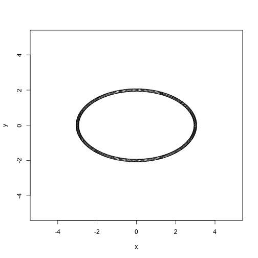
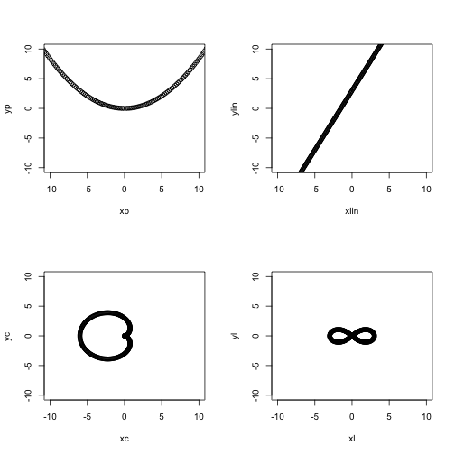

## Shiny Apps In Education

With more and more technology being integrated into classrooms, there is a growing market for interactive educational apps. 

Using Shiny, it is easier than ever to make these and distribute them to students.

This app is but one example of plenty of possible uses of Shiny in the classroom. 

---

## Slide 3

This app features many features useful to teachers: 

- Control over the variables that matter. 
- Exploration of various shapes through the use of Shiny's dynamic UI
- Easy to understand code to customize code for any equation the teacher might need

--- &twocol

## Slide 4

This app works by creating data sets using parametric examples. Here's an example for an ellipse

*** =left
 

*** =right


```r
x<-numeric()
y<-numeric()
a = 3
b = 2
n<-300

for (t in 0:(n-1)){
        x[t]=a*cos(2*pi*t/n)
        y[t]=-b*sin(2*pi*t/n)
        }
plot(y~x,xlim=c(-5,5),
     ylim=c(-5,5))
```


---

## Slide 5

As you can see, the process is simple enough. With this, an interactive graphing app is easily programmable for your class, whether you're teaching conic sections, linear equations, cardioids, or lemniscates. 


<!-- Center image on slide -->
<script type="text/javascript" src="http://ajax.aspnetcdn.com/ajax/jQuery/jquery-1.7.min.js"></script>
<script type="text/javascript">
$(function() {     
  $("p:has(img)").addClass('centered'); 
});
</script>
 

